# PB-Scale Entity-Indexed Data Lakehouse
## Comprehensive Architecture Report

---

## 1. Executive Summary

This document consolidates the complete architecture for a petabyte-scale, entity-indexed data lakehouse with HTAP-like capabilities, built greenfield on AWS with EKS as the unified compute and serving platform. The system is designed to ingest structured and unstructured data from diverse financial, telecom, and corporate sources, resolve identities in real-time using a custom Milvus-based vector similarity system, and serve analytics through a three-tier OLAP model — permanent products, ephemeral exploration products, and ad-hoc queries — all orchestrated by a network of task-specific AI agents powered by fine-tuned small language models.

### Core Design Principles

- **Semantic-first**: Every data field is described and understood before it becomes queryable. The catalogue is the entry gate, not an afterthought.
- **Entity-indexed**: The Identity Resolution Table is the universal index. It doesn't hold data — it holds pointers to where every entity's data lives across all sources in S3.
- **No medallion**: No Bronze/Silver/Gold transformation chains. Raw data goes to S3 in dual format (JSONL for AI training, Parquet/Iceberg for analytics). Products are materialized views, not transformation layers.
- **Agent-operated**: AI agents manage ingestion monitoring, schema description, relationship mapping, product creation, query routing, and system health — graduating from human-supervised to autonomous over time.
- **EKS-unified**: All compute — LLM/SLM serving, StarRocks OLAP, stream processing, training jobs, monitoring — runs on a single EKS platform for unified operations and observability.
- **Compliance-as-configuration**: Multi-country regulatory compliance is driven by policy configs, not code changes. Deploy to a new country by adding a policy file.

---

## 2. High-Level System Architecture

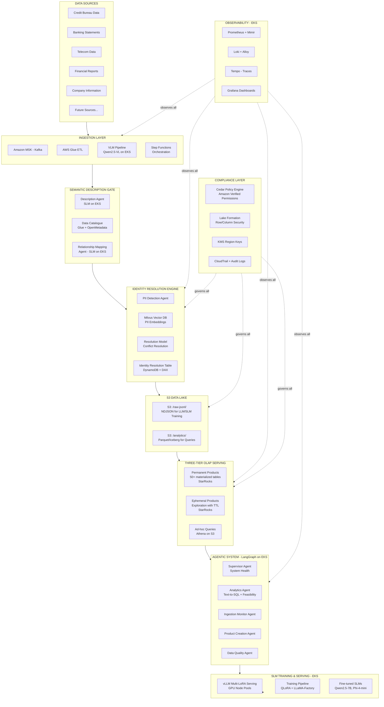

---

## 3. End-to-End Data Flow

```mermaid
flowchart LR
    subgraph Input
        RAW[Raw Data\nStructured or Unstructured]
    end

    subgraph Step1["STEP 1: Classify"]
        CLASS{Structured\nor\nUnstructured?}
    end

    subgraph Step2a["STEP 2a: Structured Path"]
        PARSE_S[Parse & Validate\nSchema Check]
        JSON_S[Convert to JSON]
    end

    subgraph Step2b["STEP 2b: Unstructured Path"]
        VLM_P[VLM Processing\nQwen2.5-VL]
        JSON_U[Guided JSON Output\nNested Structure]
        DLQ[Dead Letter Queue\nFailed Documents]
    end

    subgraph Step3["STEP 3: Semantic Description"]
        DESC[Description Agent\nAnnotate Fields]
        REG[Register in Catalogue\nGlue + OpenMetadata]
        REL[Relationship Agent\nCross-source Mapping]
    end

    subgraph Step4["STEP 4: Identity Resolution"]
        PII_D[PII Field Detection]
        EMB[Generate PII Embeddings]
        MIL_Q[Milvus ANN Search\nTop-1000 Candidates]
        RES_M[Resolution Model\nMatch or Create]
        IRT_U[Update IR Table\nEntity → S3 Pointers]
    end

    subgraph Step5["STEP 5: Dual-Format Storage"]
        W_JSONL[Write JSONL to S3\n/raw-jsonl/source/date/]
        W_PARQ[Write Parquet to S3\n/analytics/source/table/]
        ICE[Register in Iceberg\nCatalogue]
    end

    subgraph Step6["STEP 6: Product Refresh"]
        TRIG[Scheduled Trigger]
        SPARK[Spark Job\nJoin via Entity ID]
        MAT[Materialize to\nStarRocks]
    end

    RAW --> CLASS
    CLASS -->|Structured| PARSE_S --> JSON_S
    CLASS -->|Unstructured| VLM_P --> JSON_U
    VLM_P -->|Failure| DLQ
    JSON_S --> DESC
    JSON_U --> DESC
    DESC --> REG --> REL
    REL --> PII_D --> EMB --> MIL_Q --> RES_M --> IRT_U
    IRT_U --> W_JSONL
    IRT_U --> W_PARQ --> ICE
    ICE --> TRIG --> SPARK --> MAT
```

---

## 4. Component Architecture: Ingestion Pipeline

### 4.1 Structured Data Ingestion

| Data Source | Ingestion Pattern | Service | Frequency |
|---|---|---|---|
| Credit Bureau | Batch file drops (SFTP/S3) | Glue ETL | Daily/Weekly |
| Banking Statements | Batch + near-real-time events | Glue batch + MSK streaming | Daily + real-time |
| Telecom CDRs | High-volume streaming | MSK → Flink on EKS | Real-time |
| Financial Reports | Batch file drops | Step Functions → Glue | Quarterly |
| Company Information | API pulls + batch | Glue + Lambda | Periodic |

### 4.2 Unstructured Data Ingestion (VLM Pipeline)

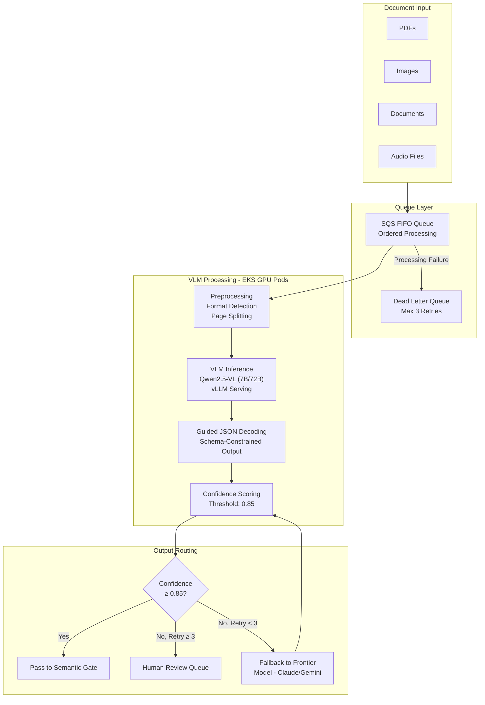

**VLM Infrastructure Specs:**
- Model: Qwen2.5-VL-7B for high-volume processing, 72B for complex documents
- Serving: vLLM on EKS with g5.xlarge pods (A10G GPU)
- Throughput: ~$0.09/1,000 pages self-hosted vs ~$1.50/1,000 via API
- Auto-scaling: Karpenter GPU NodePool, scale-to-zero when idle
- Output: Schema-constrained JSON via guided decoding (guaranteed valid structure)

---

## 5. Component Architecture: Semantic Description Gate

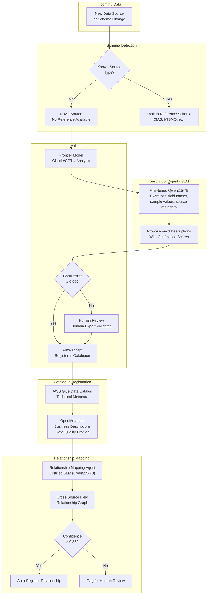

**Catalogue Schema (per field):**

```
{
  "source_id": "credit_bureau_experian",
  "field_name": "outstanding_balance",
  "data_type": "decimal(12,2)",
  "description": "Total outstanding balance across all credit accounts for the individual, including principal and accrued interest, excluding fees. Reported in the local currency of the account.",
  "pii_classification": "non_pii",
  "sensitivity_level": "confidential",
  "update_frequency": "monthly",
  "coverage_rate": 0.94,
  "related_fields": [
    {"source": "banking_statements", "field": "total_debt", "relationship": "overlapping_concept", "confidence": 0.78},
    {"source": "credit_bureau_transunion", "field": "balance_outstanding", "relationship": "equivalent", "confidence": 0.96}
  ],
  "description_confidence": 0.95,
  "described_by": "agent_v2.1",
  "last_validated": "2026-02-10T00:00:00Z"
}
```

---

## 6. Component Architecture: Identity Resolution Engine

This is a custom-built system using PII embeddings with Milvus vector database, actively being developed and tested at ~2,000 resolutions/second.

### 6.1 Resolution Flow

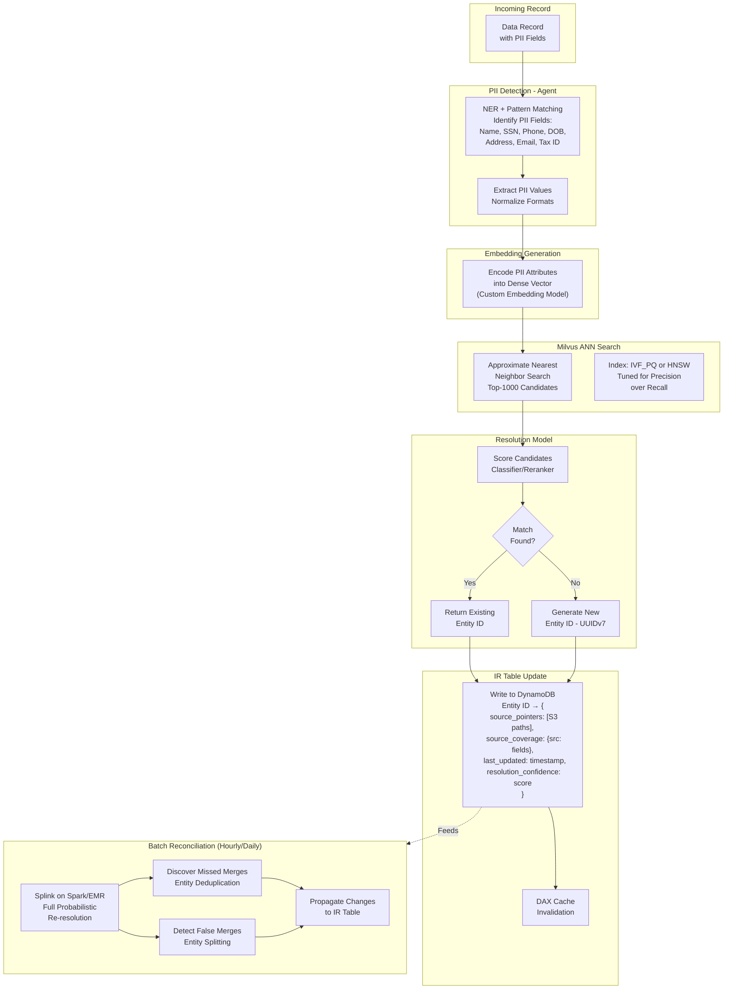

### 6.2 Identity Resolution Table Schema (DynamoDB)

```
Primary Key: entity_id (UUIDv7)

Attributes:
{
  "entity_id": "019502a4-7b3e-7f8a-9c1d-4e5f6a7b8c9d",
  "entity_type": "individual",  // or "company"
  "resolution_confidence": 0.97,
  "created_at": "2026-01-15T10:30:00Z",
  "last_updated": "2026-02-14T08:15:00Z",
  
  "source_coverage": {
    "credit_bureau_experian": {
      "s3_path": "s3://lake/analytics/credit_bureau/experian/...",
      "s3_jsonl_path": "s3://lake/raw-jsonl/credit_bureau/experian/...",
      "fields_available": ["credit_score", "outstanding_balance", "payment_history", ...],
      "record_count": 24,
      "last_record": "2026-02-01T00:00:00Z"
    },
    "banking_hsbc": {
      "s3_path": "s3://lake/analytics/banking/hsbc/...",
      "fields_available": ["account_balance", "monthly_income", "transaction_history", ...],
      "record_count": 156,
      "last_record": "2026-02-13T00:00:00Z"
    },
    "telecom_vodafone": {
      "s3_path": "s3://lake/analytics/telecom/vodafone/...",
      "fields_available": ["monthly_spend", "data_usage", "plan_type", ...],
      "record_count": 18,
      "last_record": "2026-02-10T00:00:00Z"
    }
  },
  
  "total_sources": 3,
  "total_records": 198,
  "merge_history": [
    {"merged_from": "019501b3-...", "merged_at": "2026-02-01T...", "reason": "batch_reconciliation"}
  ]
}

GSI: source_coverage_index
  - Enables queries like "all entities with credit + telecom data"
  
GSI: entity_type_index
  - Partition by individual vs company
```

### 6.3 Performance Characteristics

| Metric | Target | Mechanism |
|---|---|---|
| Inline resolution throughput | ~2,000/sec | Milvus ANN + Resolution Model |
| Deterministic match latency | < 5ms | DynamoDB DAX cache hit |
| Probabilistic match latency | < 50ms | Milvus search + model scoring |
| New entity creation | < 10ms | DynamoDB write + Milvus insert |
| Batch reconciliation | Hourly/Daily | Splink on EMR Spark |
| False merge rate | < 0.1% | Precision-tuned resolution model |

---

## 7. Component Architecture: Storage Layer

### 7.1 S3 Bucket Structure

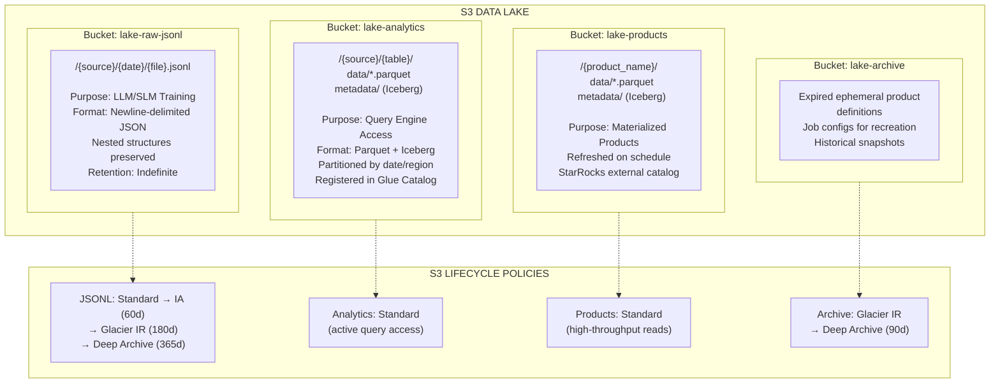

### 7.2 Dual-Write at Ingestion

The same data is written in two formats simultaneously at the end of the ingestion pipeline:

| Aspect | JSONL Copy | Parquet/Iceberg Copy |
|---|---|---|
| **Location** | `s3://lake-raw-jsonl/{source}/{date}/` | `s3://lake-analytics/{source}/{table}/` |
| **Format** | Newline-delimited JSON | Apache Parquet, Iceberg table format |
| **Structure** | Full nested structure preserved | Partially flattened (top 2-3 levels) |
| **Consumer** | SLM/LLM training pipelines | StarRocks, Athena, Redshift Spectrum |
| **Schema Registry** | N/A (schema in catalogue) | Glue Data Catalog + Iceberg metadata |
| **Compression** | gzip (~3:1) | Snappy/zstd (~5-10:1) |
| **Conversion Cost** | None (native format) | Minimal (Glue/Spark JSON→Parquet) |

---

## 8. Component Architecture: Three-Tier OLAP Serving

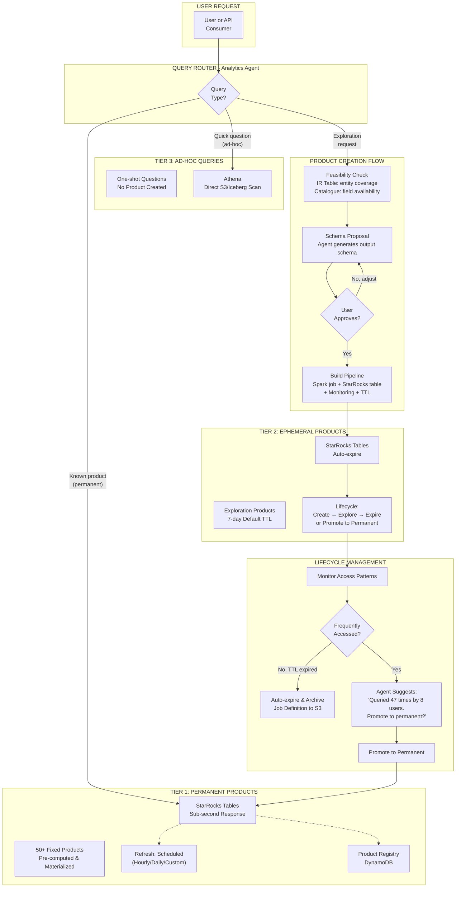

### 8.1 Permanent Product Example: Entity Credit Summary

```
Product Registry Entry:
{
  "product_id": "entity_credit_summary_v2",
  "product_type": "permanent",
  "description": "Unified credit profile per entity combining credit bureau and banking data",
  "sources_required": ["credit_bureau_experian", "credit_bureau_transunion", "banking_*"],
  "entity_type": "individual",
  "refresh_schedule": "daily_0200_utc",
  "output_schema": {
    "entity_id": "string",
    "credit_score_latest": "integer",
    "credit_score_trend_6m": "decimal",
    "total_outstanding_debt": "decimal",
    "debt_to_income_ratio": "decimal",
    "payment_history_score": "decimal",
    "num_active_accounts": "integer",
    "sources_count": "integer",
    "last_updated": "timestamp"
  },
  "serving_engine": "starrocks",
  "starrocks_table": "products.entity_credit_summary",
  "spark_job_arn": "arn:aws:glue:...:job/entity_credit_summary_refresh",
  "estimated_entities": 12500000,
  "avg_query_latency_ms": 45,
  "created_by": "data_engineering_team",
  "created_at": "2026-01-15"
}
```

### 8.2 Ephemeral Product Lifecycle

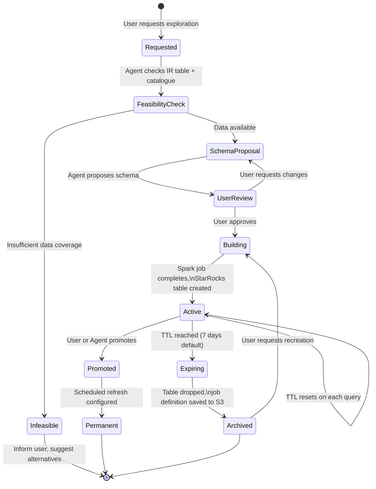

---

## 9. Component Architecture: Agentic System

### 9.1 Agent Orchestration Topology

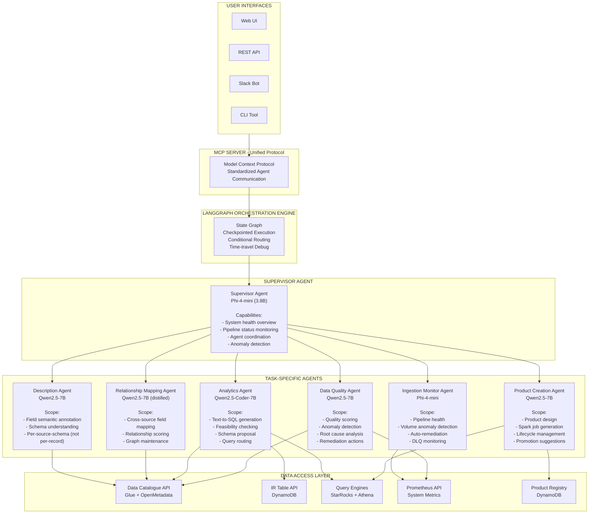

### 9.2 Agent Maturity Model

Each agent follows a graduation path from supervised to autonomous:

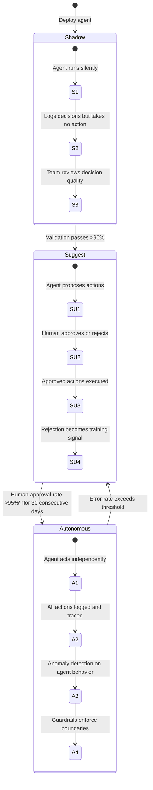

### 9.3 Analytics Agent: Multi-Step Query Workflow

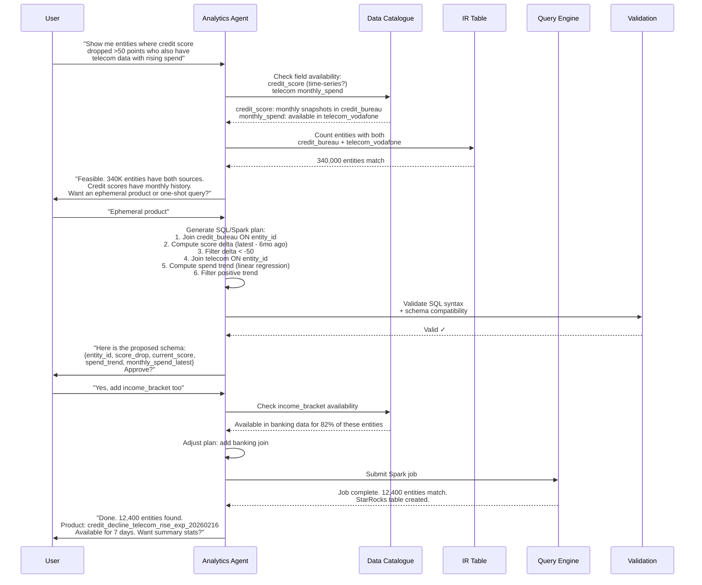

---

## 10. Component Architecture: SLM Fine-Tuning Pipeline

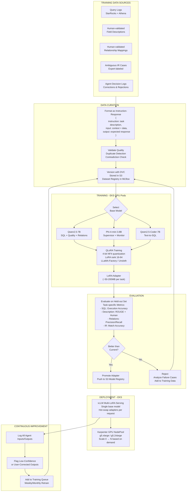

### 10.1 Model-Task Assignment

| Agent | Base Model | Parameters | GPU Required | Training Data Source | Min. Training Examples |
|---|---|---|---|---|---|
| SQL Generation | Qwen2.5-Coder-7B | 7B | g5.xlarge (A10G 24GB) | Query logs + synthetic | 10K |
| Description | Qwen2.5-7B-Instruct | 7B | g5.xlarge | Human-validated descriptions | 5K |
| Relationship Mapping | Qwen2.5-7B-Instruct | 7B | g5.xlarge | Frontier model distillation | 5K |
| Data Quality | Qwen2.5-7B-Instruct | 7B | g5.xlarge | Quality incident history | 3K |
| Supervisor | Phi-4-mini | 3.8B | g5.xlarge | System state + status reports | 2K |
| Ingestion Monitor | Phi-4-mini | 3.8B | g5.xlarge | Pipeline event history | 2K |

### 10.2 Training Infrastructure Costs

| Item | Spec | Cost |
|---|---|---|
| QLoRA training run (7B model, 10K examples) | g5.xlarge, 2-4 hours | ~$6-12 per run |
| Weekly retraining (6 models) | 6 × g5.xlarge sessions | ~$50-75/week |
| vLLM serving (production) | 2-4 × g5.2xlarge (auto-scaled) | ~$3,000-6,000/month |
| Karpenter idle (scale-to-zero) | No GPU nodes when idle | $0 |

---

## 11. Component Architecture: Monitoring & Observability

### 11.1 Full Monitoring Stack

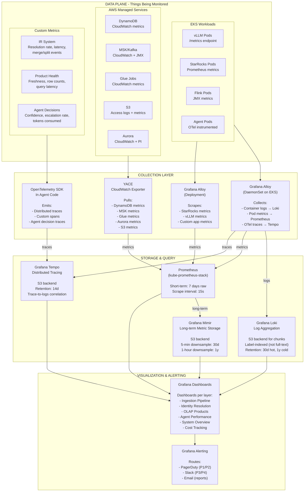

### 11.2 Monitoring Coverage Per Component

**Ingestion Pipeline:**
| Metric | Source | Alert Threshold |
|---|---|---|
| Records ingested/sec per source | MSK consumer lag + Glue metrics | < 50% of baseline for 15 min |
| VLM processing latency (p50/p95/p99) | vLLM Prometheus endpoint | p99 > 30s |
| VLM error rate | vLLM metrics + DLQ depth | > 5% error rate |
| Dead letter queue depth | SQS metrics via YACE | > 100 messages |
| Schema validation failures/min | Custom app metric | > 10/min |
| Ingestion lag (time since last record) | Custom metric per source | > 2× expected interval |

**Identity Resolution:**
| Metric | Source | Alert Threshold |
|---|---|---|
| Resolutions/second | Custom app metric | < 1,500/sec sustained |
| Match rate (deterministic/probabilistic/new) | Custom app metric | New entity rate > 30% (anomaly) |
| Resolution latency p50/p95/p99 | Custom app metric | p99 > 200ms |
| Milvus search latency | Milvus metrics | p99 > 50ms |
| DynamoDB consumed RCU/WCU | YACE CloudWatch | > 80% provisioned capacity |
| Entity merge events/day | Custom app metric | > 2× baseline |
| Entity split events/day | Custom app metric | Any (requires investigation) |
| Batch reconciliation duration | Glue/EMR job metrics | > 2× historical avg |

**OLAP / Products:**
| Metric | Source | Alert Threshold |
|---|---|---|
| Product freshness (time since refresh) | Custom metric per product | > 2× scheduled interval |
| Product row count change | Custom metric per product | > 20% swing from baseline |
| StarRocks query latency p50/p99 | StarRocks Prometheus | p99 > 2s for permanent products |
| Athena query scan volume | YACE CloudWatch | Single query > 1TB |
| Ephemeral product count | Product registry | > 200 active (cost alert) |
| Failed product refresh jobs | Glue/Spark metrics | Any failure |

**Agent Performance:**
| Metric | Source | Alert Threshold |
|---|---|---|
| Inference latency per agent (p50/p99) | vLLM Prometheus | p99 > 5s |
| Confidence score distribution | Custom metric per agent | Mean drops > 10% over 24h |
| Human escalation rate | Custom metric per agent | > 20% (agent may be degrading) |
| Tokens consumed per request | vLLM metrics | > 2× baseline (prompt bloat) |
| LoRA adapter version in use | Custom metric | Mismatch with registry |
| GPU utilization | NVIDIA DCGM exporter | > 90% sustained (scale up) |
| KV cache utilization | vLLM metrics | > 85% (memory pressure) |

**Infrastructure:**
| Metric | Source | Alert Threshold |
|---|---|---|
| EKS node count by pool | kube-prometheus-stack | GPU nodes > budget limit |
| S3 storage growth rate | S3 CloudWatch via YACE | > 120% of projected |
| DynamoDB throttled requests | YACE CloudWatch | Any sustained throttling |
| MSK consumer lag | MSK metrics | > 100K messages behind |
| Cost burn rate (daily) | AWS Cost Explorer API | > 110% of budget |

---

## 12. Component Architecture: Regulatory Compliance

### 12.1 Compliance Architecture

```mermaid
flowchart TB
    subgraph PolicyStore["POLICY CONFIGURATION STORE"]
        PC["Country Policy Configs\n(YAML/JSON in S3 + DynamoDB)\n\nPer-country definitions:\n- PII field classifications\n- Data residency requirements\n- Cross-border transfer rules\n- Retention periods\n- Right-to-erasure SLA\n- Consent requirements"]
    end

    subgraph PolicyEngines["POLICY ENFORCEMENT ENGINES"]
        CEDAR_E["Cedar / Amazon Verified Permissions\n\nUser-level access decisions:\n- Who can access what data\n- Under what conditions\n- Country-specific rules\n- Formal verification"]

        OPA_E["OPA (Open Policy Agent)\n\nInfrastructure governance:\n- Resource provisioning rules\n- Network policies\n- Deployment constraints"]

        LF_E["Lake Formation + LF-Tags\n\nData platform access:\n- Row-level security\n- Column-level security\n- Cross-account sharing\n- Tag-based policies"]
    end

    subgraph DataProtection["DATA PROTECTION"]
        KMS_E["KMS Region-Specific Keys\n\nEU data: eu-west-1 CMK\nIndia data: ap-south-1 CMK\nUS data: us-east-1 CMK\n\nCross-region decryption\nrequires explicit key grant"]

        PSEUDO["Pseudonymization Service\nDeterministic AES-GCM-SIV\n\nEnables:\n- Joins on pseudonymized data\n- Reversible with key access\n- Consistent across sources"]

        MACIE_E["Amazon Macie\nAutomated PII Discovery\n\nScans S3 buckets\nClassifies sensitive data\nTriggers LF-Tag auto-population"]

        MASK["Dynamic Data Masking\nRedshift + StarRocks\n\nField-level masking rules\nBased on user role + country"]
    end

    subgraph RightToErasure["RIGHT-TO-ERASURE WORKFLOW"]
        REQ[Erasure Request\nfor Entity X]
        LOOKUP_E[IR Table Lookup\nAll S3 locations for Entity X]
        DELETE_E["Iceberg ACID DELETE\nAcross all sources"]
        PURGE[Purge from IR Table\nDynamoDB delete]
        MILVUS_D[Remove from Milvus\nVector deletion]
        AUDIT_E[Audit Log\nS3 Object Lock - WORM]
        CONFIRM[Confirm Deletion\nWithin SLA]
    end

    subgraph AuditTrail["AUDIT & COMPLIANCE REPORTING"]
        CT["CloudTrail Organization Trails\nAll API calls across accounts"]
        LF_AUDIT["Lake Formation Audit Logs\nWho accessed what data, when"]
        S3_LOG["S3 Access Logs\nObject-level access tracking"]
        WORM["S3 Object Lock\nTamper-proof storage\n7-year retention"]
        REPORT["Compliance Dashboard\nGrafana - audit metrics"]
    end

    PolicyStore --> CEDAR_E
    PolicyStore --> OPA_E
    PolicyStore --> LF_E

    CEDAR_E --> MASK
    LF_E --> MASK
    KMS_E --> PSEUDO
    MACIE_E --> LF_E

    REQ --> LOOKUP_E --> DELETE_E --> PURGE --> MILVUS_D --> AUDIT_E --> CONFIRM

    CT --> WORM
    LF_AUDIT --> WORM
    S3_LOG --> WORM
    WORM --> REPORT
```

### 12.2 Country Policy Configuration Example

```yaml
# policy/india.yaml
country_code: "IN"
regulation: "DPDPA_2023"
aws_region: "ap-south-1"

data_residency:
  mode: "conditional"  # allowed | restricted | conditional
  rules:
    - data_type: "payment_data"
      residency: "mandatory_local"  # RBI mandate
      description: "Payment and transaction data must remain in India"
    - data_type: "general_pii"
      residency: "allowed_with_restrictions"
      allowed_destinations: ["*"]  # Blacklist model - all unless restricted
      restricted_destinations: []  # Updated as govt notifies

pii_fields:
  - field_pattern: "aadhaar*"
    classification: "sensitive_pii"
    masking: "full"
    encryption: "mandatory"
  - field_pattern: "pan_number*"
    classification: "sensitive_pii"
    masking: "partial"  # Show last 4
    encryption: "mandatory"
  - field_pattern: "*phone*"
    classification: "standard_pii"
    masking: "partial"
    encryption: "mandatory"

retention:
  default_period_days: 1095  # 3 years
  financial_data_days: 2555  # 7 years (RBI)
  after_consent_withdrawal_days: 90

right_to_erasure:
  sla_days: 30
  exceptions: ["legal_obligation", "regulatory_requirement"]

cross_border_access:
  default: "allow"  # Blacklist model
  requires_consent: true
  audit_all_transfers: true
```

```yaml
# policy/eu.yaml
country_code: "EU"
regulation: "GDPR"
aws_regions: ["eu-west-1", "eu-central-1"]

data_residency:
  mode: "conditional"
  rules:
    - data_type: "all_pii"
      residency: "allowed_with_safeguards"
      allowed_destinations_adequacy: ["GB", "JP", "KR", "CA", "NZ", "IL", "CH", "US_DPF"]
      requires_sccs: true  # Standard Contractual Clauses for non-adequate countries

retention:
  default_period_days: 1825  # 5 years
  purpose_limitation: true
  requires_justification: true

right_to_erasure:
  sla_days: 30
  exceptions: ["legal_obligation", "public_interest", "scientific_research"]

cross_border_access:
  default: "restrict"
  requires_adequacy_or_sccs: true
  audit_all_transfers: true
  dpia_required: true  # Data Protection Impact Assessment
```

### 12.3 Cedar Policy Example

```cedar
// EU GDPR: Restrict EU citizen data access to EU-based analysts
permit(
  principal in Role::"DataAnalyst",
  action in [Action::"Query", Action::"Export"],
  resource in DataSource::"credit_bureau"
)
when {
  resource.country_tag == "EU" &&
  principal.operating_region == "EU" &&
  principal.has_valid_purpose == true &&
  context.consent_verified == true
};

// India DPDPA: Block payment data transfer outside India
forbid(
  principal,
  action in [Action::"Export", Action::"CrossBorderTransfer"],
  resource
)
when {
  resource.country_tag == "IN" &&
  resource.data_type == "payment_data" &&
  context.destination_region != "ap-south-1"
};
```

---

## 13. EKS Cluster Architecture

### 13.1 Node Pool Design

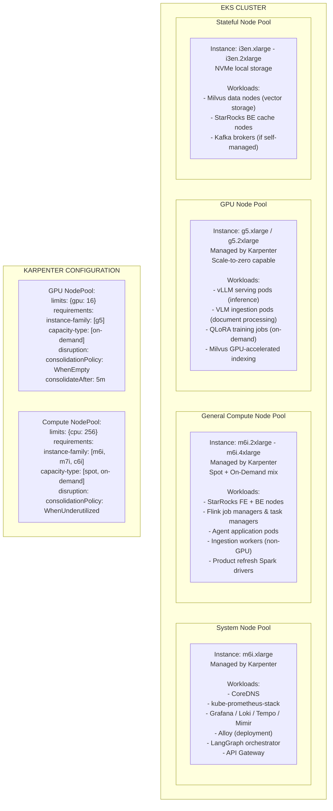

### 13.2 Namespace Organization

```
eks-cluster/
├── system/              # CoreDNS, metrics-server, Karpenter
├── monitoring/          # Prometheus, Mimir, Loki, Tempo, Grafana, Alloy
├── ingestion/           # Kafka consumers, Flink, VLM processors, Glue triggers
├── identity-resolution/ # Milvus, Resolution model serving, PII detection
├── catalogue/           # OpenMetadata, relationship mapping agent
├── olap/                # StarRocks cluster (FE + BE pods)
├── agents/              # LangGraph orchestrator, all agent pods
├── ai-serving/          # vLLM pods with multi-LoRA
├── ai-training/         # QLoRA training jobs (ephemeral pods)
├── api/                 # API Gateway, MCP server, user-facing endpoints
└── compliance/          # Cedar engine, audit log collectors
```

---

## 14. Complete Technology Stack

### 14.1 Core Infrastructure

| Layer | Technology | Purpose | AWS Service / Deployment |
|---|---|---|---|
| Compute | EKS + Karpenter | Unified compute platform | Amazon EKS |
| Object Storage | S3 | Data lake foundation | Amazon S3 |
| Table Format | Apache Iceberg | Open table format for analytics | Glue Data Catalog integration |
| Streaming | Apache Kafka | High-throughput event streaming | Amazon MSK |
| Stream Processing | Apache Flink | Real-time transformations | Flink on EKS |
| Batch ETL | Apache Spark | Heavy batch processing | AWS Glue / EMR Serverless |
| Orchestration | Step Functions | Workflow management | AWS Step Functions |
| IaC | Terraform + Helm | Infrastructure as code | N/A |

### 14.2 Data & Identity

| Layer | Technology | Purpose | Deployment |
|---|---|---|---|
| Identity Resolution | Custom (Milvus + Resolution Model) | PII-based entity matching | EKS (Milvus) + EKS (model) |
| Vector Database | Milvus | PII embedding storage + ANN search | EKS (stateful pods) |
| IR Table | DynamoDB + DAX | Entity → S3 pointer index | Amazon DynamoDB |
| Batch Reconciliation | Splink | Probabilistic re-resolution | EMR Serverless / Glue |
| Technical Catalogue | AWS Glue Data Catalog | Hive metastore, Iceberg catalog | Managed |
| Business Catalogue | OpenMetadata | Descriptions, lineage, quality, governance | EKS |
| Data Quality | Deequ + Soda Core | Quality validation | Glue (Deequ) + EKS (Soda) |
| Lineage | OpenLineage | Column-level lineage | EKS |

### 14.3 OLAP & Serving

| Layer | Technology | Purpose | Deployment |
|---|---|---|---|
| Real-time OLAP | StarRocks | Sub-second analytics, product serving | EKS |
| Ad-hoc Queries | Amazon Athena | Serverless S3 scanning | Managed |
| Entity Lookups | DynamoDB + DAX | Single-entity data fetching | Managed |
| Product Registry | DynamoDB | Product metadata + lifecycle | Managed |
| API Layer | Kong / AWS API Gateway | Request routing, rate limiting | EKS / Managed |

### 14.4 AI & Agents

| Layer | Technology | Purpose | Deployment |
|---|---|---|---|
| Agent Orchestration | LangGraph | State machine orchestration | EKS |
| Agent Communication | MCP (Model Context Protocol) | Standardized agent-data interface | EKS |
| LLM/SLM Serving | vLLM | Multi-LoRA inference serving | EKS GPU pods |
| VLM Processing | Qwen2.5-VL (7B/72B) | Unstructured document → JSON | EKS GPU pods |
| SLM Training | QLoRA via LLaMA-Factory / Unsloth | Task-specific model fine-tuning | EKS GPU pods (ephemeral) |
| Experiment Tracking | MLflow | Training metrics + model versioning | EKS |
| Dataset Versioning | DVC | Training data version control | S3 backend |
| Base Models | Qwen2.5-7B, Qwen2.5-Coder-7B, Phi-4-mini | Agent backbones | vLLM multi-LoRA |

### 14.5 Monitoring & Observability

| Layer | Technology | Purpose | Deployment |
|---|---|---|---|
| Metrics | Prometheus + Grafana Mimir | Time-series metrics (short + long term) | EKS |
| Logs | Grafana Loki | Log aggregation (label-indexed) | EKS + S3 backend |
| Traces | Grafana Tempo | Distributed tracing | EKS + S3 backend |
| Collection | Grafana Alloy | Unified telemetry collector | EKS DaemonSet + Deployment |
| AWS Metrics | YACE | CloudWatch → Prometheus bridge | EKS |
| Instrumentation | OpenTelemetry SDK | Application-level tracing | In application code |
| Visualization | Grafana | Dashboards + alerting | EKS |
| GPU Metrics | NVIDIA DCGM Exporter | GPU utilization, memory, temp | EKS DaemonSet |

### 14.6 Security & Compliance

| Layer | Technology | Purpose | Deployment |
|---|---|---|---|
| Policy Engine | Cedar / Amazon Verified Permissions | User-level access control | Managed |
| Infra Policy | OPA (Open Policy Agent) | Resource governance | EKS |
| Data Access Control | AWS Lake Formation + LF-Tags | Row/column/cell security | Managed |
| Encryption | AWS KMS (region-specific CMKs) | Data encryption at rest + transit | Managed |
| PII Discovery | Amazon Macie | Automated sensitive data detection | Managed |
| Pseudonymization | Custom (AES-GCM-SIV) | Reversible data masking | EKS / Lambda |
| Audit | CloudTrail + Lake Formation logs | Comprehensive audit trail | Managed + S3 Object Lock |

---

## 15. Feasibility Assessment

### 15.1 Component-Level Feasibility

| Component | Feasibility | Confidence | Key Risk |
|---|---|---|---|
| S3 dual-format storage | **Very High** | 95% | None — proven at exabyte scale |
| DynamoDB IR table + DAX | **Very High** | 95% | Schema design for complex queries |
| MSK streaming ingestion | **Very High** | 95% | Operational complexity at high throughput |
| VLM unstructured processing | **High** | 85% | Error handling, confidence thresholds |
| Semantic description agent | **High** | 85% | Novel source accuracy |
| Relationship mapping (distilled SLM) | **High** | 80% | Long-tail edge cases |
| Identity Resolution (Milvus + custom) | **High** | 80% | Embedding drift, false merge rate |
| Inline IR at 2K/sec | **High** | 80% | Sustained throughput under load |
| StarRocks OLAP on EKS | **High** | 85% | Operational complexity, tuning |
| Permanent product materialization | **Very High** | 90% | Standard Spark/ETL pattern |
| Ephemeral product lifecycle | **High** | 85% | Agent-driven creation complexity |
| Supervisor agent | **High** | 85% | Structured inputs — bounded problem |
| Analytics agent (text-to-SQL) | **Medium** | 65% | 60-70% initial accuracy on complex queries |
| Product creation agent | **Medium** | 70% | Autonomous pipeline creation risk |
| Agent orchestration (LangGraph) | **Medium-High** | 75% | Multi-agent coordination complexity |
| SLM fine-tuning pipeline | **High** | 85% | Training data quality |
| vLLM multi-LoRA on EKS | **High** | 85% | Karpenter GPU scaling timing |
| PLG monitoring stack | **Very High** | 95% | Battle-tested in Kubernetes |
| Multi-country compliance | **High** | 80% | Policy completeness per country |
| Right-to-erasure workflow | **High** | 85% | Cross-source deletion coordination |
| Batch reconciliation (Splink) | **High** | 85% | Proven at 100M+ records |

### 15.2 Integration Risk Matrix

The highest risk is not in individual components but in their integration:

| Integration Point | Risk Level | Mitigation |
|---|---|---|
| Ingestion → IR (inline, latency-sensitive) | **High** | Tiered matching: deterministic first, async fuzzy |
| IR Table → OLAP query acceleration | **Medium** | Pre-filter logic can miss edge cases; fall back to full scan |
| Agent → Product creation (autonomous) | **High** | Human-approve mode for 6+ months |
| Agent → Agent orchestration | **Medium** | LangGraph checkpointing + comprehensive tracing |
| CDC → StarRocks materialization | **Medium** | Monitor lag; alert on freshness violations |
| Compliance policy → query enforcement | **Medium** | Test exhaustively per country before deployment |

---

## 16. Cost Estimates (Steady-State, 1PB)

| Category | Monthly Estimate | Annual (Optimized) |
|---|---|---|
| **S3 Storage** (1PB tiered lifecycle) | $8K – $12K | $96K – $144K |
| **EKS Compute** (system + general pools) | $8K – $15K | $96K – $180K |
| **EKS GPU** (vLLM + VLM, Karpenter managed) | $4K – $8K | $48K – $96K |
| **StarRocks on EKS** (OLAP) | $6K – $10K | $72K – $120K |
| **MSK** (Kafka streaming) | $8K – $15K | $96K – $180K |
| **DynamoDB** (IR table + DAX + product registry) | $5K – $15K | $60K – $180K |
| **Glue / EMR Serverless** (batch ETL) | $5K – $10K | $60K – $120K |
| **Athena** (ad-hoc queries) | $2K – $5K | $24K – $60K |
| **Milvus on EKS** (vector DB) | $3K – $6K | $36K – $72K |
| **Monitoring stack** (PLG + Mimir on EKS) | $3K – $6K | $36K – $72K |
| **Compliance** (Macie, KMS, Lake Formation) | $2K – $5K | $24K – $60K |
| **Networking, NAT, data transfer** | $3K – $8K | $36K – $96K |
| **Total** | **$57K – $115K** | **$684K – $1.38M** |

**Key cost optimizations:**
- Karpenter scale-to-zero for GPU nodes saves 40-60% vs always-on
- S3 Intelligent-Tiering saves 40-70% on storage
- Spot instances for general compute saves 60-90%
- DynamoDB reserved capacity saves ~53%
- Graviton instances for non-GPU workloads save ~20%

---

## 17. Implementation Roadmap

### Phase 1: Foundation (Months 1-6)

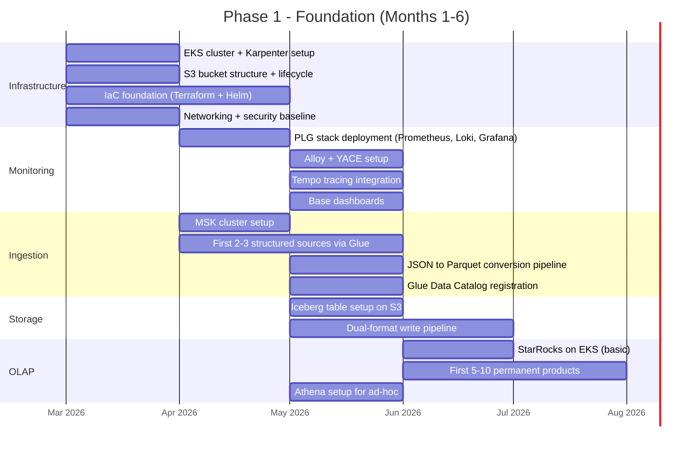

**Team: 12-15 people.** Infrastructure: 3-4. Data engineering: 4-5. Platform/DevOps: 2-3. Security: 1-2.

**Exit criteria:** Data flowing from 2-3 sources → S3 in dual format → queryable in StarRocks and Athena. Monitoring covers all deployed components. First permanent products serving.

---

### Phase 2: Identity & Core (Months 7-14)

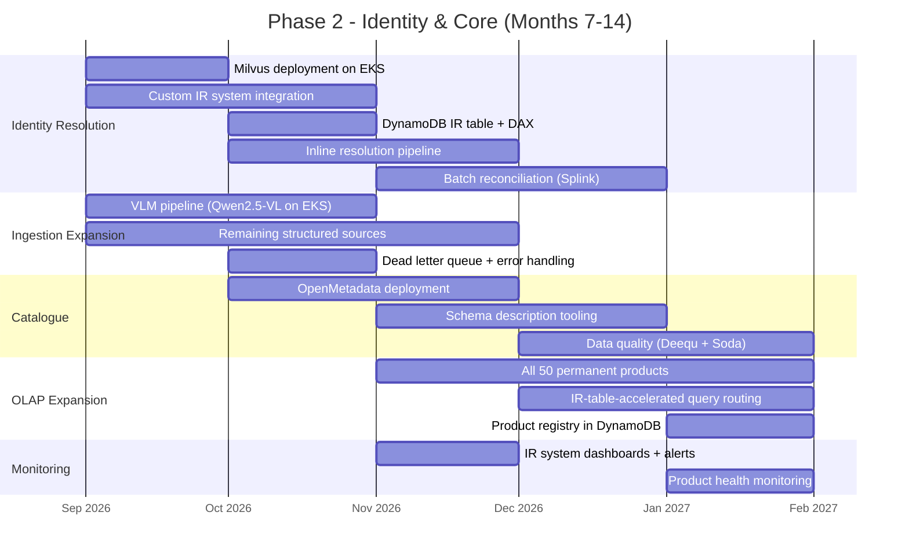

**Team: 20-25 people.** Add: ML engineers (2-3), identity resolution specialists (2-3), catalogue/governance (2).

**Exit criteria:** All data sources flowing through identity resolution. IR table accurate and serving entity lookups. 50 permanent products live. OpenMetadata catalogue populated.

---

### Phase 3: Agents & Intelligence (Months 15-22)

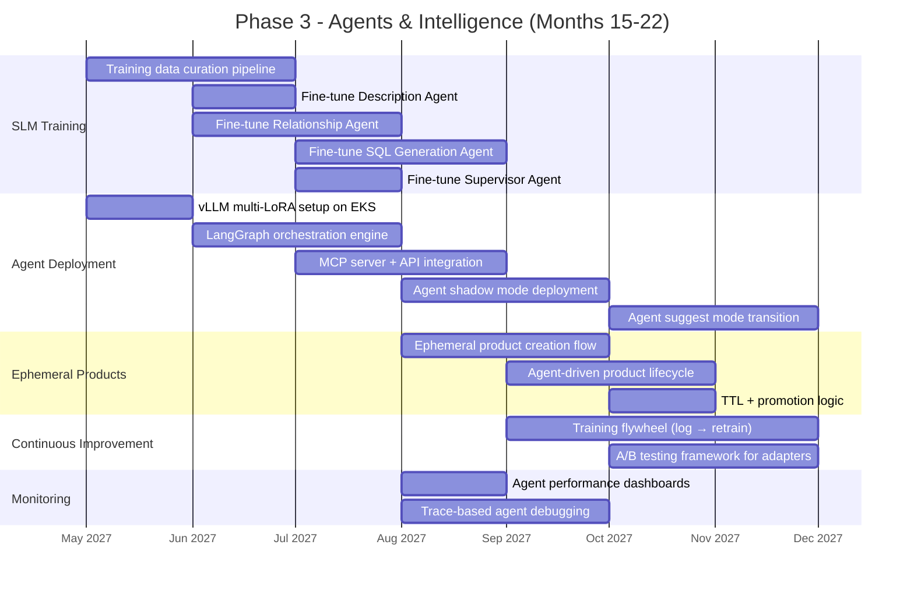

**Team: 28-32 people.** Add: AI/ML engineers (4-5), agent developers (3-4).

**Exit criteria:** All agents deployed in suggest mode. Ephemeral products working. Training flywheel operational. Agent accuracy metrics tracked and improving.

---

### Phase 4: Compliance & Scale (Months 23-30)

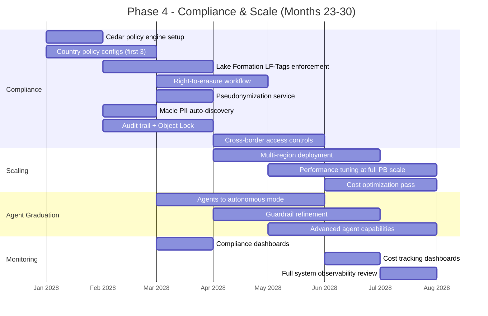

**Team: 30-35 people.** Add: Compliance/legal (2-3), security engineers (2).

**Exit criteria:** Multi-country deployment live. All compliance workflows tested and certified. Agents operating autonomously with guardrails. Full observability across all components.

---

## 18. Critical Risks & Mitigations

| # | Risk | Severity | Likelihood | Mitigation |
|---|---|---|---|---|
| 1 | Identity Resolution false merges corrupt entity data | **Critical** | Medium | Precision-tuned model, batch reconciliation, entity versioning with rollback |
| 2 | Analytics agent generates incorrect SQL on complex queries | **High** | High | Human-approve mode, query validation layer, execution sandboxing |
| 3 | VLM produces incorrect JSON from unstructured documents | **High** | Medium | Confidence scoring, dead letter queue, human review loop, fallback to frontier model |
| 4 | IR table becomes bottleneck under PB ingestion load | **High** | Medium | DynamoDB auto-scaling, DAX caching, batch writing with SQS buffer |
| 5 | Milvus index quality degrades with embedding drift | **Medium** | Medium | Periodic embedding model retraining, index quality monitoring |
| 6 | Agent orchestration cascading failures | **High** | Medium | LangGraph checkpointing, circuit breakers, fallback to manual workflows |
| 7 | Compliance violation due to policy misconfiguration | **Critical** | Low | Policy unit tests, dry-run mode, legal review gate before deployment |
| 8 | Cost overrun at PB scale | **Medium** | Medium | Cost monitoring dashboards, Karpenter scale-to-zero, S3 lifecycle, reserved capacity |
| 9 | Schema evolution breaks existing products | **Medium** | High | Schema Registry with compatibility checks, product impact analysis agent |
| 10 | Training data poisoning degrades SLM quality | **Medium** | Low | Data validation pipeline, canary deployments, A/B testing before promotion |

---

*Document Version: 1.0*
*Date: February 16, 2026*
*Status: Architecture Design — Pre-Implementation*
